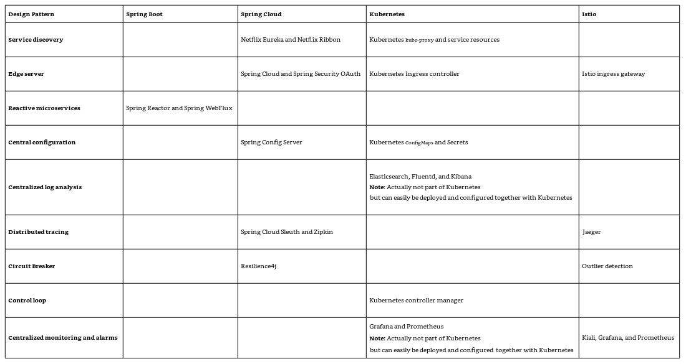
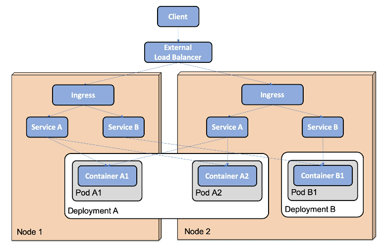
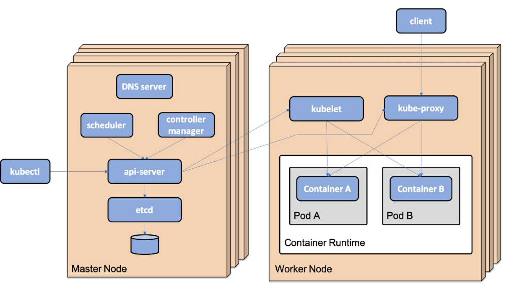

# 微服务治理需要的能力




# K8s 核心概念

## Node

Cluster中的服务器节点，可以是虚拟的，也可以是物理节点

## Pod

最小可以部署的单元，通常使用一个 Container，但是在 Service Mesh场景下，可能由两个 container 来支持一个 pod 运行，其中一个 container 运行在 sidecar 模式

## Deployment

用来部署和升级 pod. Deployment 对象将创建和监控 pod 的职责交给 ReplicaSet.第一次运行 deployment 的时候，就只是创建一个 `ReplicaSet`对象

## ReplicaSet

用来确保一定数量的 pod 运行。如果 pod被删除了，新的 pod 会被创建

## Service

服务提供一个稳定的网络端口(endpoint)，可以被用来连接一个或者多个 pod。服务会被分配 IP 地址，和 DNS名称。IP地址和 service 在 service 的生命周期范围内是一致的。向服务发出的请求会被以轮询的方式分布到不同的 pod 上进行请求。

## Ingress

管理外部访问，通常使用 HTTP协议。作为网关假设在 service前，对服务的请求进行控制。

## Namespace

用来对资源进行分组、隔离，在同一个 namespace 里的资源名称必须唯一，但是在不同的 namespace 下可以重名。

## ConfigMap

配置管理，可以被映射到容器中，作为运行环境或者某个文件。可实现动态配置

## Secret

用来存储敏感数据，比如用户登录信息等。

但是任何有权限访问的API客户端，都可以获取，所以，需要好好规划和控制

## DaemonSet

确保每个节点有一个 pod 运行，比如 log controller，Fluentd, 会在每个 worker 节点运行

## 举例



## 运行期架构




# 安装 mimikube

[下载地址](https://github.com/kubernetes/minikube/releases/)

# 阿里云加速

进入 minikube 的 docker 环境运行

```sh
tee /etc/docker/daemon.json <<-'EOF'
{
  "registry-mirrors": ["https://uyah70su.mirror.aliyuncs.com"]
}
EOF
```

重启服务

```sh
sudo systemctl daemon-reload && sudo systemctl restart docker
```


# 设置 profile

切换到`my-profile`

```sh
minikube profile my-profile
```


# 启动 Kubernetes Cluster

```sh
minikube start
```

```sh
minikube start --memory=10240 --cpus=8 --disk-size=80g --vm-driver=docker
```


# 停止 Kubernetes Cluster

```sh
minikube stop
```


# 删除 Kubernetes Cluster

```sh
minikube delete --profile handson-spring-boot-cloud
```

# 查看 Dashboard

```sh
minikube dashboard
```


# 查看 context

```sh
kubectl config get-contexts
```


# 切换 context

后续的命令将在 `hands-on`命名空间中应用

```sh
kubectl config set-context $(kubectl config current-context) --namespace=hands-on
```

# 删除 context

```sh
kubectl config delete-context <context-name>
```


# 查看所有的 pod

```sh
kubectl get pod -A
```

# 删除 pod

```sh
kubectl delete pod --selector app=nginx-app
```

# 查看命名空间

```sh
kubectl get namespace
```

# 创建命名空间

```sh
kubectl create namespace orange
```

# 删除命名空间

```sh
kubectl delete namespaces <insert-some-namespace-name>
```

# 查看 kube-system 包含的服务

```sh
kubectl get pods --namespace=kube-system
```

# 查看节点(Node)

```sh
kubectl get nodes -A
```

